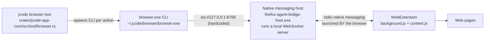

# Chrome Browser Bridge Plan

Date: 2026-08-02. Author: jcode self-dev session.
Goal: make jcode's `browser` tool drive Chrome (Michael's daily browser), without
breaking the existing Firefox path.

## 1. Current architecture (investigated)

The bridge has four pieces, three of which are **browser-agnostic**:

- `crates/jcode-app-core/src/tool/browser.rs`: the `browser` tool. Maps tool
  actions (open, click, snapshot...) to bridge actions (navigate, click,
  getContent...) and shells out to the downloaded `browser.exe` CLI with
  `<action> <json-params>`.
- `crates/jcode-base/src/browser.rs`: setup/status. Downloads three release
  assets from `1jehuang/firefox-agent-bridge` (CLI `browser.exe`, native host
  `firefox-agent-bridge-host.exe`, extension `browser-agent-bridge.xpi`) into
  `~/.jcode/browser/`, writes the Firefox native messaging manifest, and on
  Windows registers `HKCU\Software\Mozilla\NativeMessagingHosts\firefox_agent_bridge`.
- The **native host** is started by the browser (native messaging, stdio
  length-prefixed JSON). It also opens a WebSocket server on `127.0.0.1:8766`
  (the CLI has this hardcoded; the host honors `FAB_WS_HOST`/`FAB_WS_PORT`
  env overrides but the CLI does not). It relays CLI requests to the extension
  and responses back.
- The **extension** (`background.js`, `content.js`, `popup.js`, MV2) does the
  actual work: `browser.runtime.connectNative("firefox_agent_bridge")`, then
  dispatches actions to tabs/windows APIs or to `content.js` via
  `tabs.sendMessage`.

Key insight: `browser.exe` and the host do not know or care which browser is
attached. Whichever browser launches the host and connects the extension is the
one that gets driven. So the Rust side needs **no protocol changes**, only:
Chrome extension packaging + Chrome-side native messaging registration.

## 2. What is Firefox-specific

Extension (shipped `.xpi`, unminified, inspectable):

| Item | Firefox (current) | Chrome (needed) |
|---|---|---|
| Manifest | MV2, `background.scripts`, `browser_action`, `browser_specific_settings.gecko` | MV3: `background.service_worker`, `action`, `host_permissions`, `key` (stable ID for unpacked) |
| API namespace | `browser.*` (promise-based) | `chrome.*` (MV3 is promise-based too) -> tiny `browser` shim |
| `browser.browserAction` | exists | `chrome.action` -> shim alias |
| `onMessage` listener returning a Promise | supported | NOT supported; needs `sendResponse` + `return true` -> shim wraps `addListener` |
| Page-world eval (`window.wrappedJSObject`, `cloneInto`) | Firefox Xray APIs | absent in Chrome. Code already guards with try/catch and falls back, so `eval pageWorld:true` and the fancy contenteditable path degrade gracefully. Proper fix later: `chrome.scripting.executeScript({world:"MAIN"})` |
| Extension install | signed `.xpi` opened in Firefox | unpacked directory + "Load unpacked" (one-time manual step), Web Store not needed |
| Native messaging manifest | `allowed_extensions` (gecko IDs), registry `HKCU\Software\Mozilla\NativeMessagingHosts\<name>` | `allowed_origins: ["chrome-extension://<id>/"]`, registry `HKCU\Software\Google\Chrome\NativeMessagingHosts\<name>` |
| MV3 service worker lifetime | n/a (persistent background page) | open native messaging port keeps the SW alive (Chrome 105+), so the always-on `connectNative` loop works |

jcode Rust side: everything under `browser.rs` that mentions Firefox is
install/registration/messaging-text only. Action execution is shared.

## 3. Implementation plan (Phase 2)

Parallel-path design: new module + new provider; zero behavior change for
Firefox. `browser='auto'` and `browser='firefox'` keep resolving to the
existing Firefox provider. `browser='chrome'` selects the new one.

1. **`crates/jcode-base/src/browser_chrome.rs`** (new):
   - `generate_chrome_extension()`: extract the already-downloaded
     `browser-agent-bridge.xpi` (zip) into
     `~/.jcode/browser/chrome-extension/`, drop `META-INF/`, and write:
     - `manifest.json` rewritten to MV3 (permissions minus `webRequest`,
       `<all_urls>` moved to `host_permissions`, `key` field pinned so the
       unpacked extension ID is stable:
       `ccfekfoninbngnemlgcnnicejjgbogln`).
     - `browser-shim.js`: defines `globalThis.browser` over `chrome`, aliases
       `browserAction -> action`, and wraps `runtime.onMessage.addListener` so
       Promise-returning listeners work (content-script responses).
     - `sw.js`: `importScripts("browser-shim.js", "background.js")`.
     - `content_scripts.js` list becomes `["browser-shim.js", "content.js"]`.
   - Zip extraction with no new crate dependency: `tar -xf` (bsdtar ships with
     Windows 10+ and macOS), fallback `powershell Expand-Archive` on Windows /
     `unzip` elsewhere.
   - `install_chrome_native_host_manifest()`: write
     `~/.jcode/browser/firefox_agent_bridge.chrome.json` (same host binary,
     same `firefox_agent_bridge` name so `connectNative` matches,
     `allowed_origins` for the pinned ID) and register
     `HKCU\Software\Google\Chrome\NativeMessagingHosts\firefox_agent_bridge`.
   - `ensure_chrome_setup()`: download shared assets if missing (reuses
     existing downloader), generate extension, register host, then ping and
     print the one manual step.
2. **`crates/jcode-app-core/src/tool/browser.rs`**: add `ChromeBridgeProvider`
   with `supported_browsers = ["chrome"]`. `setup`/`status` call the chrome
   module; `execute` reuses the existing bridge-command path (same CLI, same
   WS port). `resolve_provider` gains the `chrome` arm; the old error message
   stays for safari/edge.

### Constraints and known limitations
- Only one browser can host the bridge at a time (the host binds port 8766).
  If Firefox with the extension and Chrome with the extension are both
  running, the second host fails to bind. In practice: use one, or disable the
  extension in the other.
- `eval` with `page_world: true` and drag-drop file upload degrade on Chrome
  until a `chrome.scripting` MAIN-world path is added upstream (follow-up).
- Incognito "sandbox" sessions require the user to enable "Allow in
  Incognito" for the extension.

### Manual step for Michael (one-time)
1. Run browser setup for Chrome (tool: `browser` action=`setup` browser=`chrome`,
   or `jcode browser setup` once wired).
2. Chrome > `chrome://extensions` > enable Developer mode > "Load unpacked" >
   select `C:\Users\micha\.jcode\browser\chrome-extension`.
3. Done. The pinned manifest `key` keeps the ID stable across reloads.

## 4. Effort estimate

- Rust module + provider wiring: ~300-400 lines, low risk (parallel path). ~2-3 h.
- Extension MV3 transform + shim: the delicate part is the onMessage shim and
  MV3 service worker; the shipped JS is unminified and mostly portable. ~2-3 h
  including testing in Chrome.
- Total: roughly a day of focused work. Straightforward -> Phase 2 approved
  criteria met.
