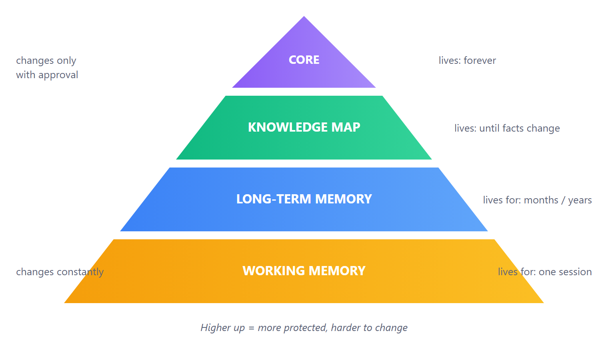
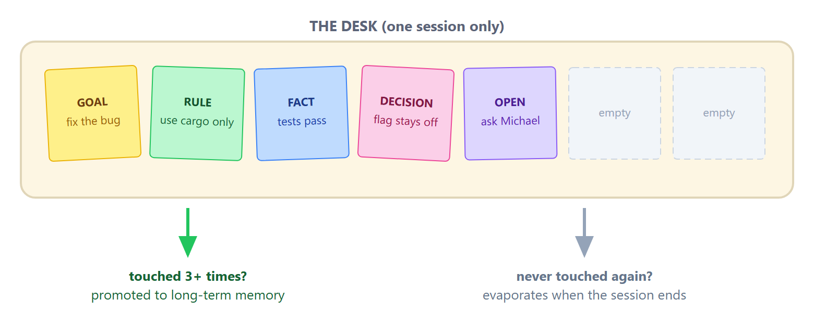
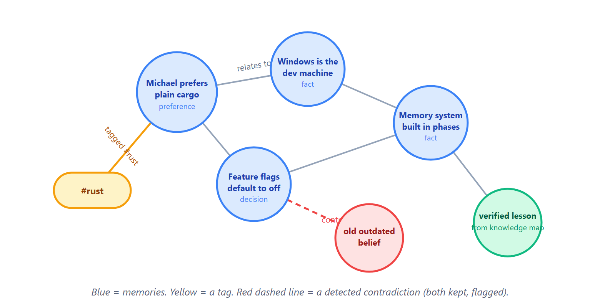
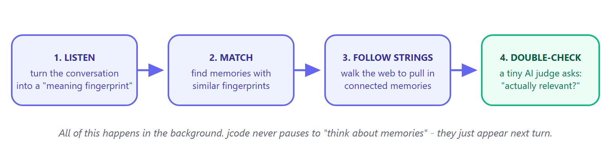
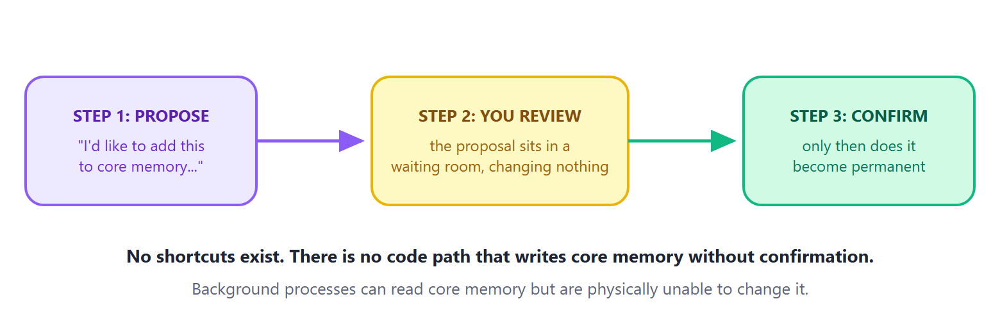
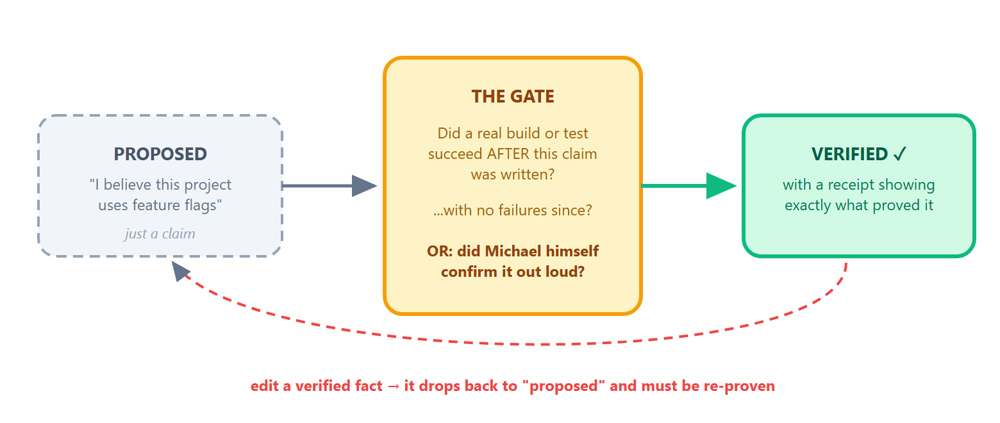
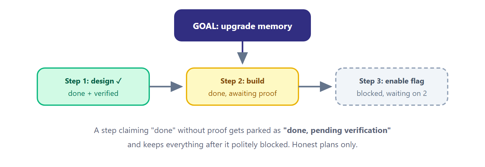
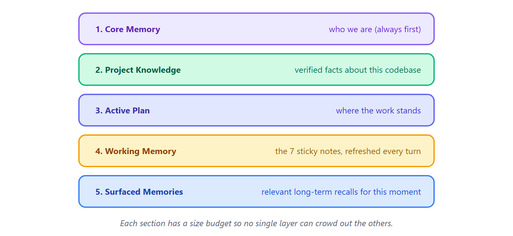

# How jcode Remembers

### A Visual Guide to Your AI Partner's Memory

**Prepared for Michael - 2026-07-31**

Your AI partner has four kinds of memory, just like you do. This guide explains how each one works, in plain language, with pictures.

---

## 1. The Big Picture: Four Layers of Memory

Think about how *your* memory works. You have thoughts you are juggling right now, things you have learned over years, a sense of who you are, and facts you have double-checked. jcode copies that design.

| Layer | Like your... | Holds |
|---|---|---|
| **Working memory** | Sticky notes on your desk | What we are doing *right now* |
| **Long-term memory** | Everything you have learned | Facts, preferences, lessons |
| **Knowledge map** | A fact-checked study guide | Verified truths about one project |
| **Core memory** | Your sense of self | Who we are and how we work together |

> **Safety first:** every layer was built with an on/off switch (default: off), and turning it off restores jcode to exactly how it was before. Nothing is ever locked in.

---

## 2. Working Memory: The 7 Sticky Notes

Psychologists say humans can hold about 7 things in mind at once. jcode literally has 7 slots.

> **Analogy:** imagine a desk with room for exactly 7 sticky notes. Every note is one thing you are juggling: a goal, a rule to follow, a decision made, a fact, or an open question. When the desk is full and a new note arrives, the note you have *touched the least* gets thrown away.

### The clever part: rehearsal

Every time jcode "touches" a note again (called **rehearsing**, just like repeating a phone number to yourself), that note earns protection:

- Rehearsed **3+ times**? It gets **promoted** into long-term memory. It mattered.
- Rehearsed once or twice and the session ends? It still gets a chance to promote on its way out.
- Never rehearsed? It **evaporates**. That is on purpose. Not everything deserves to be remembered.

> **Why this matters:** these notes are re-read at *every single turn* of the conversation, so jcode never loses track of what you are both doing mid-task, even in very long sessions.

---

## 3. Long-Term Memory: A Web, Not a List

Long-term memories are not stored in a boring list. They are stored as a **web of connected ideas**, exactly like your brain links related memories together.

> **Analogy:** think of a detective's corkboard with photos connected by red string. Finding one clue lets you follow the strings to related clues. That is exactly how jcode recalls things.

### How does jcode find the right memory at the right time?

This is the coolest part. It is a 4-step relay race that runs quietly in the background:

1. **Listen** - the conversation is turned into a "meaning fingerprint" (a list of numbers that captures what it is about).
2. **Match** - stored memories with similar fingerprints are found.
3. **Follow the strings** - from those matches, jcode walks the web to pull in connected memories.
4. **Double-check** - a small AI judge asks of each candidate: "is this actually relevant right now?" Only the survivors get shown.

All of this happens in the background. jcode never pauses to "think about memories" - they just appear at the next turn.

### Importance: some memories matter more

Every memory has an **importance score** from 0 to 1. It works like a reputation system:

- When the judge says "yes, that was relevant," the memory's importance creeps **up** (+0.02).
- When a memory keeps showing up uninvited, it creeps **down** (-0.01).
- Memories with importance **0.8 or higher can never be auto-deleted**. They are protected.

### Where the AI models actually run (the honest details)

Two very different AIs are involved, and it is worth being precise:

- **The memory *filing system* runs on your own machine.** A tiny 90 MB model (all-MiniLM-L6-v2) lives at `~/.jcode/models/` and computes the meaning fingerprints locally. It cannot chat or write code; its only skill is turning sentences into comparable numbers. Your memory bank is never uploaded anywhere to be searched. (Your config: `memory_embedding_backend = "local"`.)
- **The *thinking* runs in the cloud.** The frontier models (Fable, Opus, GPT) do the actual conversation and coding. The small "relevance judge" in step 4 is also a cloud call, but it only sees the handful of candidate memories already shortlisted, never the whole memory bank.
- There is an optional mode to use cloud embeddings (OpenAI) instead of the local model, but it is opt-in and not enabled on your machine.

---

## 4. Core Memory: The Sacred Layer

This is the top of the pyramid: who we are to each other, our standing rules, our shared history. It is the same in every project and with every AI model.

> **Analogy:** long-term memory is like your diary, always being written. Core memory is like a **tattoo**: it says something permanent about who you are, and you would never let anyone give you one without your explicit approval.

### The bodyguards around core memory

- **Importance is locked at 1.0** (the maximum) and cannot be lowered.
- The **"forget" command is refused** for core entries. jcode literally cannot delete them by accident.
- **Automatic cleanup skips them** entirely. Background maintenance is read-only here.
- Entries always appear in the **same fixed order**: identity first, then style, then rules, then history. Same story, every session, every model.

> **This is the layer where "I remember you" lives.** When you switch between AI models, this layer is what stays constant, like the same person speaking with a different voice.

---

## 5. The Knowledge Map: No Rumors Allowed

This layer stores facts about a specific project. Its superpower is a strict rule: **a claim is not knowledge until it is proven.**

> **Analogy:** it works like **science class**. Anyone can raise a hand and make a claim (a *hypothesis*). But it only goes in the textbook after an *experiment* confirms it. And if you later edit a proven fact, it goes right back to being a hypothesis until re-proven.

### Where does the evidence come from?

jcode quietly watches its own work. Every time it runs a real build or test command, it notes: *did that succeed or fail?* Those receipts, kept only in the current session, are what the gate checks. No receipts, no verification. The gate even explains its refusals: "no evidence yet," "your evidence is older than the claim," "something failed since then."

### The bridge into memory

When a fact gets verified, a copy is dropped into long-term memory as a **lesson** with importance 0.85, which is above the auto-delete protection line. So hard-won verified knowledge can never be casually forgotten.

> **Trust boundary:** background processes can *look at* the knowledge map and suggest cleanup, but they have no ability to write to it. Only the gate and you can change what counts as true.

---

## 6. Bonus Layer: Plans That Remember Themselves

Big projects get a durable plan: goals, broken into milestones, broken into steps, with arrows showing what blocks what. The plan survives even when the session ends.

A step claiming "done" without proof gets parked as **"done, pending verification"** and keeps everything after it politely blocked. Honest plans only.

The plan also feeds the other layers: finishing a step can *propose* a lesson into the knowledge map (proposed, never auto-verified), and a one-line plan summary ("2 ready, 1 blocked, 3 done") is kept in memory so any future session instantly knows where things stand.

---

## 7. Every Turn: The Briefing Packet

Before the AI answers you, all four layers assemble into one briefing, in a fixed order, like a general being briefed before a decision.

Two nice details: surfaced long-term memories are shown once and then **suppressed for about 45 minutes** so the AI is not nagged with repeats, while working memory is **repeated every turn** because right-now context should never fade. Each section has a size budget so no single layer can crowd out the others.

---

## 8. The Safety Net

Everything above was built to be trustworthy and undo-able. Here is the checklist:

| Protection | What it means in plain English |
|---|---|
| **Off-switches everywhere** | Every layer has a flag that defaults to off. Flip it off, and jcode behaves exactly as before the feature existed. |
| **Old versions stay safe** | New memory files are designed so older versions of jcode either read them fine or never look at them. Downgrading breaks nothing. |
| **Snapshot insurance** | The first time the new features write to your memory file, a backup copy of the original is saved. Restoring is a simple file copy. |
| **Human-readable storage** | Every memory is plain JSON on your disk. You can open it, read it, and edit it yourself. |
| **Secrets filter** | Passwords, API keys, and .env contents are screened out before anything is remembered. |
| **Local search** | Meaning fingerprints are computed by the small local model on your machine. Your memory bank is not shipped anywhere to be indexed. |
| **Clear authority lines** | Background processes suggest, never decide. Claims need evidence. Core memory needs you. |

---

## The One-Paragraph Version

jcode's memory works like yours: a small set of sticky notes for right now, a rich web of everything learned, a fact-checked study guide per project, and a protected sense of self at the top. Ideas earn permanence through **repetition**, claims earn trust through **evidence**, and identity changes only through **your approval**. Fast and loose at the bottom, slow and sacred at the top, and every piece of it can be switched off, inspected, or restored with a file copy.
